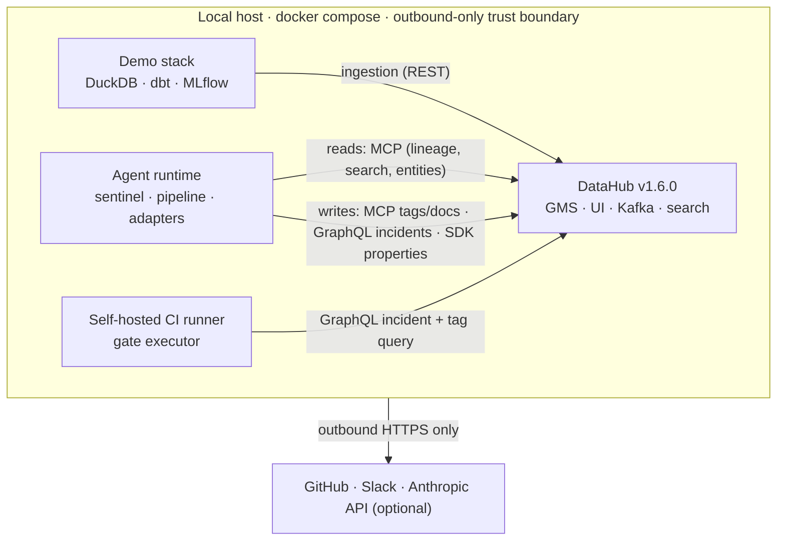

# Blast Radius 💥

> An autonomous agent that guards the data supply chain of production ML models — it finds every model in the blast radius of an upstream change, proves it with evidence, blocks bad deploys, drafts the validated fix, and writes everything back into DataHub. **The agent keeps no database: its memory is the metadata graph.**

Built for the [DataHub Agent Hackathon](https://datahub.devpost.com/) — Challenge 3, *Production ML Agents*.

```
[1/5] DETECT    rename: amount_usd (DOUBLE) → amount (BIGINT)   ← nothing crashed
[2/5] TRAVERSE  raw_transactions → … → avg_amount_30d → fraud_model ● deployed env=PROD
[3/5] DIAGNOSE  breaking — a renamed column is referenced by downstream SQL · P0
[4/5] ACT       ✓ incident  ✓ model-at-risk tag  ✓ doc  ✓ owner alert  ✓ fix PR (dbt-validated)
[5/5] REMEMBER  re-run ⇒ duplicate suppressed — the graph already knows
```

## 60-second quickstart

Prerequisites: Docker (≥8 GB RAM allocated), [uv](https://docs.astral.sh/uv/), GNU make, Python 3.11+. No Anthropic key required — the demo's fix generator has a deterministic fallback, or set `LLM_PROVIDER=ollama`.

```bash
git clone https://github.com/Danishlynx/blast-radius && cd blast-radius
make up        # DataHub v1.6.0 + MLflow, waits healthy, mints a token into .env
make seed ingest train backfill   # the world: warehouse → dbt → MLflow → full lineage in DataHub
make demo      # break production and watch the agent catch it, end to end
```

- DataHub UI: http://localhost:9002 (datahub / datahub) · MLflow: http://localhost:5000
- Restore after the demo: `make resolve && make seed && make ingest`
- Full acceptance suite: `make e2e`

## The story: break it yourself

A fraud model serves production traffic. Its supply chain — warehouse tables → dbt feature tables → MLflow training → deployed endpoint — is fully modeled in DataHub with column-level lineage, captured SQL, and ownership.

`make break-it` merges another team's "cleanup": `amount_usd` (dollars, float) becomes `amount` (cents, bigint). **Nothing errors.** Classically, predictions are silently garbage for weeks. Instead:

1. **Detect** — the sentinel (`make watch`, a schema poller; or `blast-radius scan <urn>`) diffs DataHub's schema versions and normalizes the change.
2. **Traverse** — the agent walks downstream column-level lineage via the **DataHub MCP server**, hop by hop to every feature, model, and deployment, collecting owners.
3. **Diagnose** — it reads the *actual SQL DataHub captured*, confirms the renamed column is referenced, and scores severity P0 (breaking + referenced + PROD deployment).
4. **Act** — files a DataHub **incident** with the full evidence chain, tags the model `model-at-risk` (via **MCP mutation tools**), appends a warning to the model docs, alerts owners (Slack/console), and opens a **fix PR** — patched in an isolated worktree and validated with a real `dbt build` against the broken warehouse *before* the PR opens.
5. **Remember** — run it again: the agent finds its own incident by evidence hash and updates it. *Duplicate suppressed.*

And independently: `blast-radius audit` walks each feature's lineage *backwards* hunting **target leakage** — and catches the feature that sees the future. Try to deploy anyway? The **gate** asks DataHub first and fails the job.

## What DataHub provides vs. what Blast Radius adds

| DataHub ships (we compose it) | Blast Radius adds |
|---|---|
| Column-level lineage + impact-analysis UI | An agent that *walks* that lineage autonomously, tolerates partial column lineage (name-match passthrough with confidence marking), and turns the walk into a severity verdict |
| Incidents API (`raiseIncident`, documented for programmatic use) | Evidence-chain incidents with a stable hash → **idempotent re-runs** ("update, don't duplicate") — the graph as the agent's only memory |
| [Circuit-breaker pattern](https://docs.datahub.com/docs/api/tutorials/incidents) for data pipelines | The same pattern extended to **ML deploy CI**: a GitHub Action that joins upstream incidents + model risk tags and physically blocks the deploy |
| MCP server with read tools + (v0.5+) mutation tools | Verified read **and write** against OSS GMS: traversal reads and tag/doc writes go through MCP, incidents through GraphQL, with SDK fallback |
| Captured/compiled SQL on dbt assets | SQL-aware diagnosis (referenced vs cosmetic; semantic unit-shift detection) and **structural leakage rules** over that SQL |
| Analytics Agent (chat with the catalog) | Not rebuilt — nothing here is conversational search; every capability acts on the graph |

**On leakage specifically:** existing leakage checks (e.g. SageMaker Data Wrangler's) are *statistical* — they need the training data. Blast Radius's auditor is *structural* — lineage + captured SQL only: L1 (feature derived from the label), L2 (lineage crosses a `post-outcome` asset), L3 (forward-looking SQL windows, LLM-confirmed when configured). High-precision on lineage evidence, honestly reported — every verdict names the rule and the path.

## Architecture



The agent is **stateless** — no database, no local files as source of truth. Idempotency comes from the evidence hash matched against DataHub's own incidents; safe under re-delivery and mid-run crashes. Adapters (`agent/adapters/`) are thin and contain zero business logic; the pipeline (`sentinel → traverse → diagnose → act → memory`) is pure logic with table-driven tests.

## The deployment gate (use it on any repo)

```yaml
- uses: Danishlynx/blast-radius/gate@main
  with:
    datahub_gms: ${{ vars.DATAHUB_GMS_URL }}
    datahub_token: ${{ secrets.DATAHUB_TOKEN }}
    model_query: fraud_model   # or model_urn: exact URN
```

Red ❌ with a job summary listing every blocker (and DataHub links) while any upstream incident is ACTIVE or the model carries `model-at-risk` / `leakage-suspect`; green ✅ otherwise.

## Production hardening

- **Detection**: swap the poller for the shipped Kafka path (`datahub-actions` Entity Change Events, `category=TECHNICAL_SCHEMA`) — all triggers emit the same normalized event.
- **Scale-out**: the agent is stateless; run N replicas, idempotency is already graph-enforced.
- **Existing DataHub**: point `DATAHUB_GMS_URL`/`DATAHUB_TOKEN` at any instance — nothing here is quickstart-specific.
- **Human-in-the-loop**: `APPROVAL_REQUIRED_SEVERITIES=P0,P1` switches those severities to plan-only mode.
- **LLM**: `LLM_PROVIDER=anthropic|ollama`, prompts versioned in `prompts/`; every LLM use degrades to a deterministic path.

## Open-source contributions

- **`skill/datahub-ml-impact`** — an ML impact-analysis skill for the DataHub skills registry (which today has no ML skill): blast-radius walking, severity rubric, structural leakage rules over the MCP tools. **PR: [datahub-project/datahub-skills#91](https://github.com/datahub-project/datahub-skills/pull/91)**
- **`rfc/ml-entity-incidents.md`** — RFC to extend Incidents to `mlModel`/`mlFeature`/`mlFeatureTable`, motivated by the concrete limitation this agent hit (incidents can't attach to models; see the two-signal workaround in `agent/act.py` + `gate/gate.py`). **Filed: [datahub-project/datahub#18911](https://github.com/datahub-project/datahub/issues/18911)**

## Evaluation

`make e2e` runs the acceptance suite on a live stack: the world exists with column-level lineage (8 checks) → break → one run files exactly one incident + tag + run log → re-run is a visible no-op → gate red → resolve → gate green → world restored → leakage audit flags exactly the planted feature. `examples/` holds artifacts from real runs: evidence-chain JSON, the leakage report, lineage screenshot, transcript. Unit tests: `uv run pytest` (39 table-driven checks over diff/severity/leakage/hash logic).

## License

Apache-2.0
